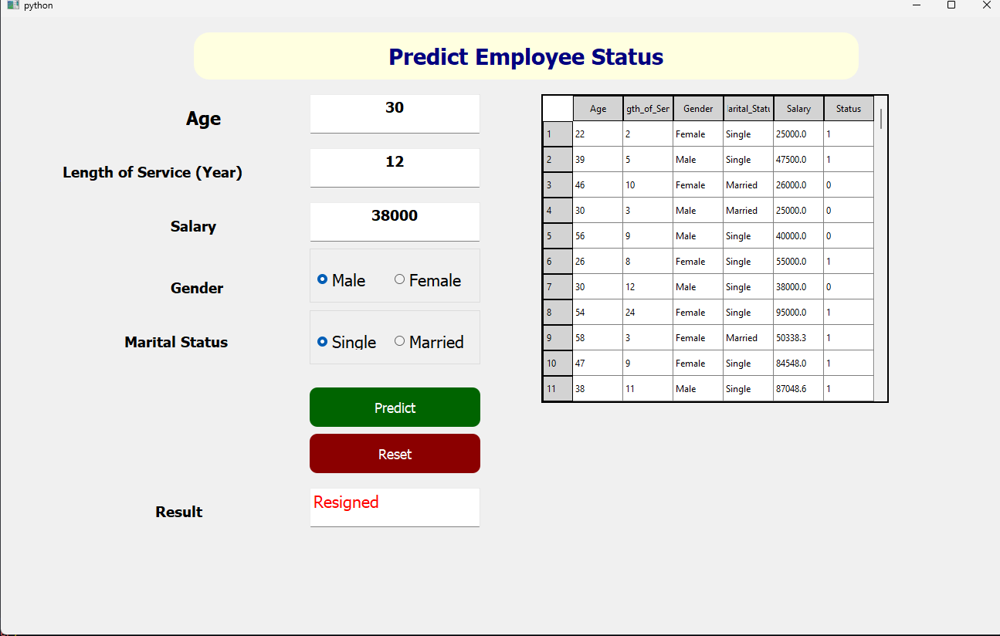
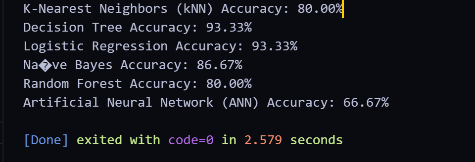

# Python-Application-Model-Decision_Tree_Employee

**Python-Application-Model-Decision_Tree** is a Machine Learning project where the primary goal is to build a model using Decision Tree to predict whether an employee will stay or leave the company. The model is trained on various features like age, length of service, salary, gender, and marital status. After training the model, it is integrated into a Python application with a user-friendly interface built using `PyQt5`. This application allows users to input details and receive predictions about an employee's status (whether they will stay or leave).

## Features

- **Decision Tree Model**: Trained on employee data to predict whether an employee will stay or leave the company based on various attributes.
- **User Interface**: Built with `PyQt5`, featuring fields for input and displaying results.
- **Model Prediction**: Uses the trained model to predict the status (Employed/Resigned) of an employee.
- **Data Display**: Displays data from a CSV file in a table format for user reference.
- **Reset Function**: Clears all input fields and resets the application state.

## Screenshot

### Main Application Screen


### Train Model


## Getting Started

This project demonstrates the process of training a machine learning model and integrating it into a Python application. Below are the steps to set up and run the project:

### Prerequisites

Ensure you have the following tools installed:
- Python (version 3.7 or later)
- PyQt5
- Pandas
- Scikit-learn
- Joblib
- A trained Decision Tree model (`decision_tree_model.pkl`)
- CSV data file (`data.csv`)

### Installation

1. Clone the repository:
   ```bash
   git clone https://github.com/your_username/Python-Application-Model-Decision_Tree.git
   ```

2. Navigate to the project directory:

    ```bash
    cd Python-Application-Model-Decision_Tree
    ```

3. Install the required Python dependencies:
    ```bash
    pip install -r requirements.txt
    ```

4. Ensure that you have the trained model and CSV file in the project directory:
    - A trained Decision Tree model (`decision_tree_model.pkl`)
    - CSV data file (`data.csv`)

5. Run the application:

    ```bash
    employee_status.py
    ```
    
## **Folder Structure**

```bash
Python-Application-Model-Decision_Tree/
│
├── assets/
│   ├── Main-Page.png      # Screenshot of the main app screen
│   ├── Train-Model.png   # Screenshot of the Train Model
│
├── data/
│   ├── data.csv             # CSV data for input display
│
├── model/
│   ├── decision_tree_model.pkl  # Trained Decision Tree model
│
├── employee_status.py                  # Main Python file running the application
├── Train_model.py         # Train Model
├── create_model.py         # Create Model
└── README.md                # Project documentation
 ```

## **Training the Model**
In this project, a Decision Tree Classifier is used to predict whether an employee will stay (Employed) or leave (Resigned) the company. The model is trained using historical employee data that includes features such as:

- Age: The age of the employee.
- Length of Service: The number of years the employee has been with the company.
- Salary: The employee's monthly salary.
- Gender: The gender of the employee.
- Marital Status: Whether the employee is single or married.

### **Training Steps**
To train the model, follow these steps:

1. **Data Preparation**: The dataset is typically in a CSV format with the following columns:

- `Age`: The age of the employee (numeric).
- `Length_of_Service`: The number of years the employee has worked (numeric).
- `Salary`: The salary of the employee (numeric).
- `Gender`: The gender of the employee (categorical: Male/Female).
- `Marital_Status`: The marital status (categorical: Single/Married).
- `Status`: The target variable (categorical: Employed/Resigned).

2. **Data Encoding**: Convert categorical variables (such as Gender and Marital_Status) into numerical values using encoding techniques such as Label Encoding or One-Hot Encoding.

3. **Model Training**: We use the Decision Tree Classifier from Scikit-learn to train the model. Below is the Python code to train the model:

```python
import pandas as pd
from sklearn.model_selection import train_test_split
from sklearn.tree import DecisionTreeClassifier
from sklearn.preprocessing import LabelEncoder
import joblib

# Load the dataset
df = pd.read_csv('data.csv')

# Encode categorical variables
label_encoder = LabelEncoder()
df['Gender'] = label_encoder.fit_transform(df['Gender'])  # Male=0, Female=1
df['Marital_Status'] = label_encoder.fit_transform(df['Marital_Status'])  # Single=0, Married=1

# Features and target variable
X = df[['Age', 'Length_of_Service', 'Salary', 'Gender', 'Marital_Status']]
y = df['Status']  # 1 = Employed, 0 = Resigned

# Split the data into training and testing sets
X_train, X_test, y_train, y_test = train_test_split(X, y, test_size=0.2, random_state=42)

# Initialize the Decision Tree Classifier
model = DecisionTreeClassifier(random_state=42)

# Train the model
model.fit(X_train, y_train)

# Save the trained model to a file
joblib.dump(model, 'decision_tree_model.pkl')

# Evaluate the model (optional)
accuracy = model.score(X_test, y_test)
print(f'Model Accuracy: {accuracy * 100:.2f}%')

```
4. **Model Evaluation**: After training, we can evaluate the model using metrics like accuracy, confusion matrix, or cross-validation. In this case, the model.score() method is used to evaluate accuracy on the test set.

5. **Saving the Model**: After training, the model is saved to a file (decision_tree_model.pkl) using the joblib.dump() function. This file can then be loaded into the Python application for predictions.

### **Predicting with the Model**
Once the model is trained and saved, it can be loaded into the Python application, and predictions can be made based on user input. The application will use the model to predict whether an employee will stay or leave.

## **Resources**
To learn more about the libraries used, check out the following resources:

- Scikit-learn Decision Trees
- Joblib Documentation
- Pandas Documentation
- PyQt5 Documentation
## **Contributing**
This project is open for contributions. Feel free to submit issues or pull requests to improve the project. Contributions are welcome to enhance the functionality or add new features such as additional models, new input fields, or advanced prediction algorithms.

## **About the Project**
This project is designed to demonstrate how machine learning models can be integrated into desktop applications. It provides an opportunity for learning how to use Python for both training models and creating user-friendly interfaces with PyQt5.

Enjoy building and exploring the world of Machine Learning with Python! 🚀

```markdown
ข้อมูลในส่วนของการฝึกโมเดล (Train Model) ได้อธิบายถึงวิธีการใช้ **Decision Tree** สำหรับทำนายการออกจากงานหรือไม่ของพนักงาน พร้อมทั้งแสดงขั้นตอนในการฝึกโมเดลและการนำโมเดลไปใช้ในแอพพลิเคชั่นด้วยครับ

```